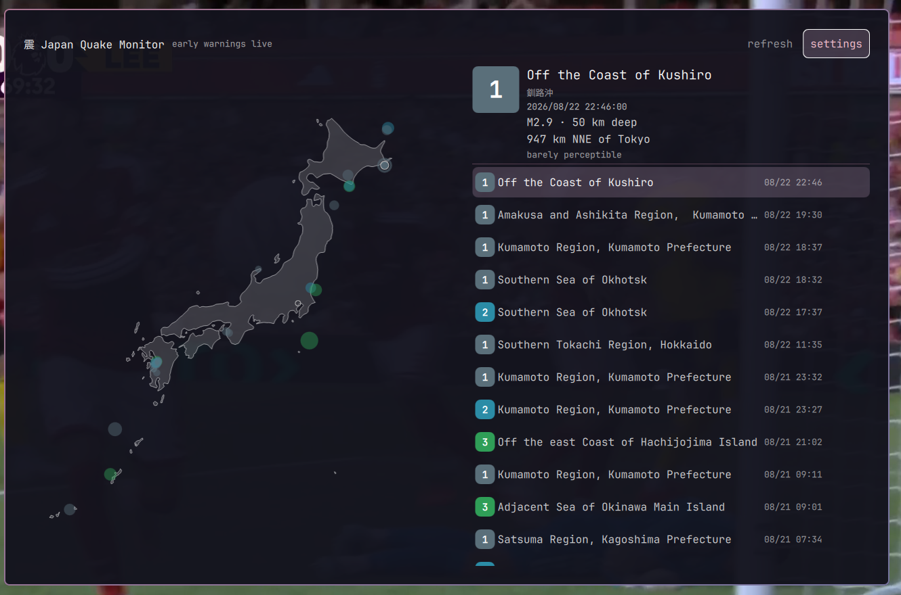

# Japan Quake Monitor

**Japanese earthquakes, on a map of Japan, with a pop-up when one happens.**



Japan records around a dozen earthquakes a day and most of them nobody feels, so
the interesting question is never "did one happen" but "was that one worth
knowing about". Japan Quake Monitor answers it: every quake lands on the map and in the list,
and only the ones above a threshold you choose take over the screen.

## Where the data comes from

Every number this plugin shows — the epicentre, the magnitude, the depth, the
intensity, the tsunami status — originates with the **Japan Meteorological
Agency** (気象庁 / JMA), which is the official and only authoritative source for
earthquake information in Japan. Japan Quake Monitor measures nothing itself,
calculates nothing, and interprets nothing. It displays JMA's published
bulletins and adds only the distance from Tokyo.

It reaches those bulletins by two routes:

- **[P2P地震情報](https://www.p2pquake.net/)** (`api.p2pquake.net`), an
  independent Japanese service that republishes JMA's bulletins as JSON, and
  pushes them over a WebSocket as they are issued. This is where the confirmed
  reports and the early warnings come from. It is a relay, not a second
  opinion: the content is JMA's.
- **[JMA directly](https://www.jma.go.jp/bosai/map.html)** (`www.jma.go.jp`),
  read only to get the official English name for each epicentre, which the
  relay does not carry.

The coastline is [Natural Earth](https://www.naturalearthdata.com/) 1:50m
Admin 0, which is in the public domain.

This is a convenience for looking at published information. It is not an
emergency system, it is not operated by or affiliated with JMA, and it should
not be the thing you rely on in a real earthquake.

## What it shows

The map plots each epicentre as a disc, sized by magnitude and coloured by
**shindo** — Japan's seismic intensity scale. Shindo is not magnitude. Magnitude
describes the earthquake; shindo describes what it did to a particular place,
and it is the number people in Japan actually react to. It runs from 1 to 7,
with 5 and 6 each split into a weak and a strong band, and Japan Quake Monitor uses the same
colours for it that Japanese broadcasters do.

The most recent quake pulses. Selecting any quake — by clicking it or with the
arrow keys — shows the epicentre in both Japanese and English, the magnitude,
the depth, the tsunami status, and how far it was from Tokyo and in which
direction.

The bar icon shows the intensity of the latest quake as a coloured number, so
one glance is enough.

## Early warnings

Optional, and off is a perfectly reasonable choice.

**Confirmed reports** are JMA's 震源・震度情報. They arrive a couple of minutes
after a quake and they are never wrong.

**Early warnings** are 緊急地震速報. They arrive *seconds before* the shaking
does, which is the entire point of them, and they are forecasts: sometimes
overstated, occasionally cancelled outright a moment later. Japan Quake Monitor draws them as
a cross rather than a disc so they are never mistaken for something confirmed,
and labels them as forecasts.

Because a warning that arrives after the shaking is worthless, early warnings
need a connection held open rather than a feed checked periodically. Switching
them off in the settings closes that connection, and Japan Quake Monitor then only polls for
confirmed reports.

## The sound

A short chime when a quake passes your threshold, and a different, more
insistent one for an early warning — different on purpose, because the two mean
different things. Either can be switched off in the settings, where there are
also two buttons to play them on demand.

Both are generated rather than sampled: two detuned oscillators beating against
each other, intervals pulled forty cents off equal temperament so they never
quite resolve, a pitch that sags as the sound decays, and the whole thing played
backwards, so it swells out of nothing and stops dead. The script that produces
them is `sounds/make-sounds.py`, and running it regenerates both files — nothing
about them is borrowed, and nothing is hidden.

They are deliberately *not* an imitation of Japan's broadcast early-warning
chime, which is a copyrighted composition.

## Install

```
omarchy plugin add https://github.com/weedwhitesandwine/japanquake.git --enable
```

The first time it opens it shows the settings, so you can choose your threshold
and give it a hotkey. Until you do, you can open it from a terminal:

```
omarchy-shell shell toggle io.github.weedwhitesandwine.japanquake
```

## Update

```
omarchy plugin update io.github.weedwhitesandwine.japanquake --yes
```

## Remove

Turn the hotkey and the bar icon off in the settings first — that removes
Japan Quake Monitor's marked block from `bindings.lua` and its entry from the bar — then:

```
omarchy plugin remove io.github.weedwhitesandwine.japanquake
```

The only thing left behind is `~/.local/state/japanquake/`, which you can delete.

## What it runs, reads and writes

**Network.** Japan Quake Monitor contacts two hosts, and reads from both — it never sends
anything but the request itself.

| Host | What for | When |
|---|---|---|
| `api.p2pquake.net` | Confirmed reports (JMA code 551) over HTTPS | Every 30 seconds |
| `api.p2pquake.net` | Early warnings (JMA code 556) over a WebSocket | Held open, only while early warnings are switched on |
| `www.jma.go.jp` | The English name for each epicentre, cached locally | Alongside each report poll |

**Background process.** One: `japanquaked.py`, started as a child of the shell with
`setpriv --pdeathsig TERM` so it cannot outlive the shell, and holding a lock
file so a second copy steps aside. It is what polls the feeds and holds the
early-warning connection. It uses nothing outside the Python standard library —
including its WebSocket client, which is written out longhand in that file so
there is no library to install and nothing hidden.

**Files it writes**, all inside its own state directory:

| Path | What |
|---|---|
| `~/.local/state/japanquake/state.json` | The recent quakes and the latest warning |
| `~/.local/state/japanquake/place-names.json` | Japanese → English epicentre names, cached |
| `~/.local/state/japanquake/settings.json` | Your choices |
| `~/.local/state/japanquake/japanquaked.lock` | So only one engine runs |

**Files it writes outside that directory** — only when you press **Apply** in
the settings, never on its own:

| Path | What |
|---|---|
| `~/.config/hypr/bindings.lua` | Only Japan Quake Monitor's own marked block, between `-- >>> japanquake hotkey` and `-- <<< japanquake hotkey`. Everything outside those two lines is copied through untouched |
| `~/.config/omarchy/shell.json` | Only Japan Quake Monitor's own `{"id": "io.github.weedwhitesandwine.japanquake"}` entry, moved between the bar layout and the enabled-plugins list |

**Commands it runs:** `python3` (the engine, and the JSON edit inside the
helper), `bash` (the helper script and the settings write), `hyprctl reload` so
a newly chosen hotkey takes effect, `xdg-open` when you click one of the
data-source links on the settings page, and `pw-play` for the alert sound.

## Dependencies

`bash`, `python3`, `hyprctl` and `pw-play`, all of which Omarchy already
installs — `pw-play` comes with PipeWire.

## Licence

MIT — see [LICENSE](LICENSE).

## Credits

Built with [Claude Code](https://claude.com/claude-code). The idea was my son's.
